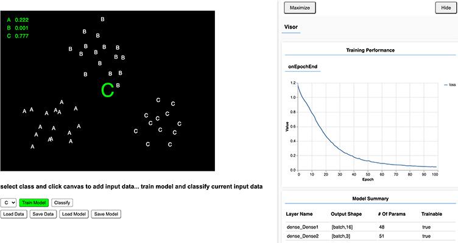
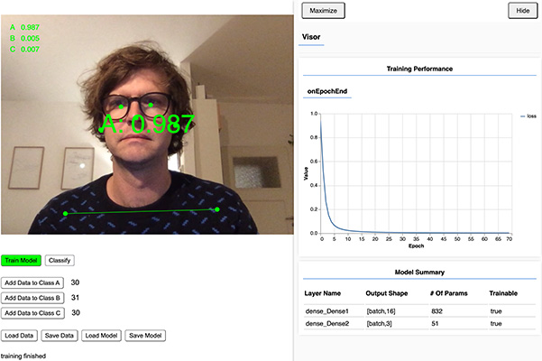
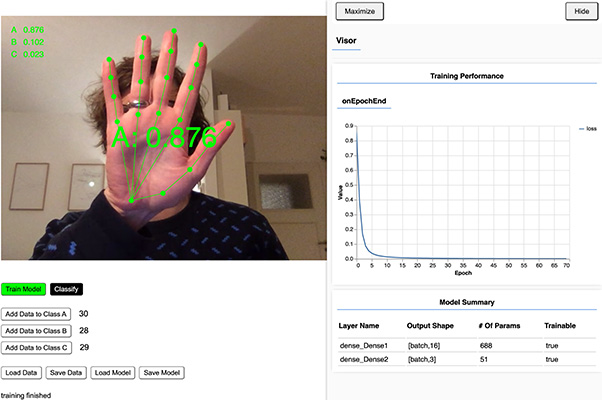
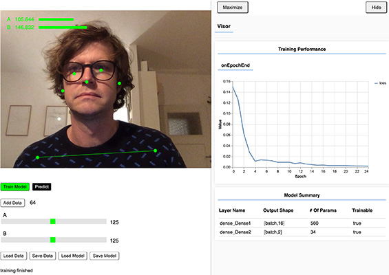
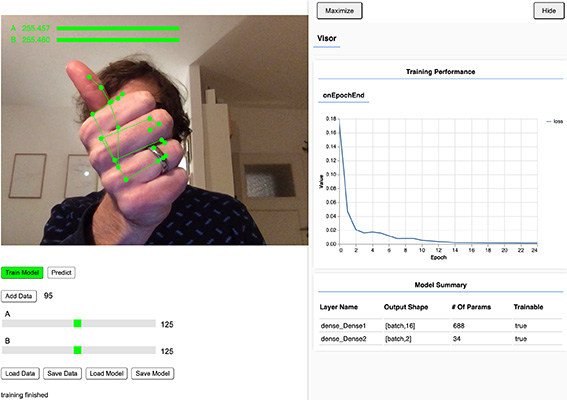

# ml5.js poseNet
live demo [poseNet](https://hybridthingslab.github.io/course-teachable-machines/Block_II/01_poseNet/)

reference:
* https://learn.ml5js.org/#/reference/posenet

insights:
* https://github.com/tensorflow/tfjs-models/tree/master/posenet
* https://medium.com/tensorflow/real-time-human-pose-estimation-in-the-browser-with-tensorflow-js-7dd0bc881cd5

# ml5.js handpose
live demo [handpose](https://hybridthingslab.github.io/course-teachable-machines/Block_II/02_handpose/)

reference:
* https://learn.ml5js.org/#/reference/handpose

insights:
* https://google.github.io/mediapipe/solutions/hands.html
* https://blog.tensorflow.org/2020/03/face-and-hand-tracking-in-browser-with-mediapipe-and-tensorflowjs.html

# ml5.js facemesh
live demo [facemesh](https://hybridthingslab.github.io/course-teachable-machines/Block_II/03_facemesh/)

reference:
* https://learn.ml5js.org/#/reference/facemesh

insights:
* https://google.github.io/mediapipe/solutions/face_mesh.html
* https://blog.tensorflow.org/2020/03/face-and-hand-tracking-in-browser-with-mediapipe-and-tensorflowjs.html 

# ml5.js KNN Classifier
nice explanation via Coding Train: 
* https://youtu.be/Mwo5_bUVhlA?t=170 

## KNN Classifier simple (position mouse x, y)
live demo [KNN_classifier_simple](https://hybridthingslab.github.io/course-teachable-machines/Block_II/04_KNN_classifier_simple/)

## KNN Classifier poseNet
live demo [KNN_classifier_poseNet](https://hybridthingslab.github.io/course-teachable-machines/Block_II/05_KNN_classifier_poseNet/)

## KNN Classifier handpose
live demo [KNN_classifier_handpose](https://hybridthingslab.github.io/course-teachable-machines/Block_II/06_KNN_classifier_handpose)

## KNN Classifier facemesh
live demo [KNN_classifier_facemesh](https://hybridthingslab.github.io/course-teachable-machines/Block_II/07_KNN_classifier_facemesh/)

## KNN Classifier video
live demo [KNN_classifier_video](https://hybridthingslab.github.io/course-teachable-machines/Block_II/08_KNN_classifier_video/)

reference:
* https://learn.ml5js.org/#/reference/knn-classifier
## tutorials via Coding Train
* Part 1: https://www.youtube.com/watch?v=KTNqXwkLuM4&feature=emb_title
* Part 2: https://www.youtube.com/watch?v=Mwo5_bUVhlA&t=1030s
* Part 3: https://www.youtube.com/watch?v=JWsKay58Z2g
## further examples
* handpose: https://editor.p5js.org/AndreasRef/sketches/vyiGyVon9

# ml5.js Neural Network
nice introduction via Coding Train: 
* https://www.youtube.com/watch?v=8HEgeAbYphA

reference:
* https://learn.ml5js.org/#/reference/neural-network

## Neural Network Classifier simple (position mouse x, y)
live demo [NeuralNetwork_classifier](https://hybridthingslab.github.io/course-teachable-machines/Block_II/10_NeuralNetwork_classifier_loadSave_simple/)

further tutorials via Coding train:
* https://thecodingtrain.com/learning/ml5/6.1-train-your-own.html
* https://thecodingtrain.com/learning/ml5/6.2-save-data.html
* https://thecodingtrain.com/learning/ml5/6.3-save-model.html

## Neural Network Classifier poseNet
live demo [NeuralNetwork_classifier_poseNet](https://hybridthingslab.github.io/course-teachable-machines/Block_II/11_NeuralNetwork_classifier_poseNet/)

## Neural Network Classifier handpose
live demo [NeuralNetwork_classifier_handpose](https://hybridthingslab.github.io/course-teachable-machines/Block_II/12_NeuralNetwork_classifier_handpose/)

## Neural Network Regression simple (position mouse x, y, 3 sliders)
live demo [NeuralNetwork_classifier](https://hybridthingslab.github.io/course-teachable-machines/Block_II/14_NeuralNetwork_regression_simple/)

further tutorial via Coding train:
* https://thecodingtrain.com/learning/ml5/6.4-regression.html

## Neural Network Regression poseNet
live demo [NeuralNetwork_classifier_poseNet](https://hybridthingslab.github.io/course-teachable-machines/Block_II/15_NeuralNetwork_regression_poseNet/)

further tutorial via Coding train:
* https://thecodingtrain.com/learning/ml5/7.3-pose-regression.html

## Neural Network Regression handpose
live demo [NeuralNetwork_classifier_poseNet](https://hybridthingslab.github.io/course-teachable-machines/Block_II/16_NeuralNetwork_regression_handpose/)

