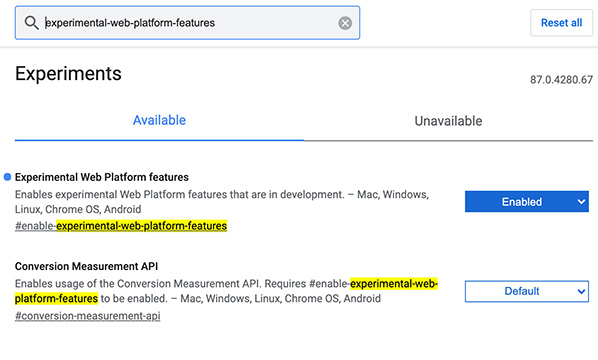
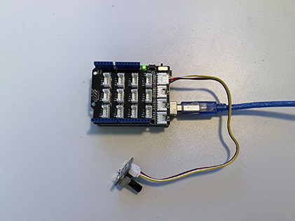
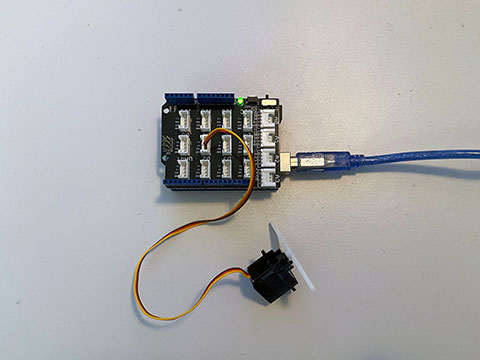
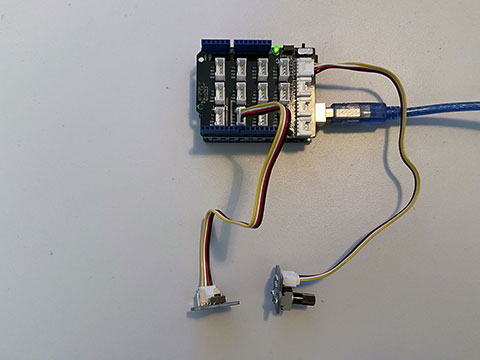
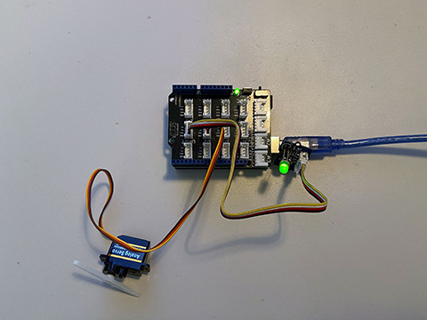

# Let's Get Physcial

## p5.js, Arduino and the Grove Starter Kit
Learn how to sense and control things in your physical environment by connection an Arduino microcontroller to your Mac/PC, attach sensors and actuators and writing basic code to let all of them commmunicate.

### Get your tools

* Ardunio UNO, Seedunio, Funduino UNO or similar
* USB Data Cable for your Arduino. __Attention: Some USB Cable are only for charging, not for Data!__
* [Seeed Studio Grove - Starter Kit for Arduino](https://www.seeedstudio.com/Grove-Starter-Kit-for-Arduino-p-1855.html)

### Environment
* Download and install the Arduino IDE from [Arduino.cc](https://www.arduino.cc/en/Main/Software) - on Mac, drag the software to your Applications Folder
* Connect your Arduino to your Mac/PC using a USB Cable
* Open the Arduino Software
* Set the Port in "Tools > Port", on Windows it will be something like "COM5", on MAC more like "/dev/cu.usbmodem14301"
* Select the Board you attached in "Tools > Board: ...", most definitely "Arduino Uno"
* Open a first Example in "File > Examples > 01.Basics > Blink"
* Upload the Sketch to your Board with "Sketch > Upload" or the Arrow pointing right
* The blue LED should now blink

### Attaching Modules to the Arduino
* Carrefully attach the big Grove Base Shield, so that each metal pin goes into its hole
* Set the votage selector on the switch right beside the A0 socket to "5V"
* Plug the green LED into the corresponding holes of the "LED Socket" module, the LED has a "flat" side that should point in the same direction as on the symbolic circle right below the holes
* Attach the LED Socket module to Socket D3 of the Grove Base Shield
* Attach the Rotary Angle Sensor in A0

### Serial API to communicate between P5.js and Arduino
The [Serial API](https://web.dev/serial/) provides a way for websites to read from and write to a serial device with JavaScript. Currently this feature is an "experimental" feature in Google Chrome. To experiment with the Serial API locally on all desktop platforms, without an origin trial token, enable the ```experimental-web-platform-features``` flag opening [chrome://flags](chrome://flags) in your browser.




### Funken - Serial protocol toolkit Library
We use the amazing [Funken library](https://github.com/astefas/Funken) to send all kind of variables (also text, numbers...) and also multiple of them back and forth. Find furthere informations to install additional Arduino Libraries [here](https://www.arduino.cc/en/Guide/Libraries).

# Examples

## 01 send a sensor value from Arduino to p5.js
live demo [01_serial_read_singleValue](https://hybridthingslab.github.io/course-teachable-machines/Block_III/p5js/01_serial_read_singleValue)

|[p5.js Code](https://github.com/HybridThingsLab/course-teachable-machines/tree/master/Block_III/p5js/01_serial_read_singleValue)|[Arduino Code](https://github.com/HybridThingsLab/course-teachable-machines/tree/master/Block_III/Arduino/01_serial_write_singleValue)|
:-------------------------:|:-------------------------:
|

## 02 send a value from p5.js to Arduino
live demo [02_serial_write_singleValue](https://hybridthingslab.github.io/course-teachable-machines/Block_III/p5js/02_serial_write_singleValue)

[p5.js Code](https://github.com/HybridThingsLab/course-teachable-machines/tree/master/Block_III/p5js/02_serial_write_singleValue) | 
[Arduino Code](https://github.com/HybridThingsLab/course-teachable-machines/tree/master/Block_III/Arduino/02_serial_read_singleValue)




## 03 send two sensor values from Arduino to p5.js
live demo [03_serial_read_multipleValues](https://hybridthingslab.github.io/course-teachable-machines/Block_III/p5js/03_serial_read_multipleValues)

[p5.js Code](https://github.com/HybridThingsLab/course-teachable-machines/tree/master/Block_III/p5js/03_serial_read_multipleValues) | 
[Arduino Code](https://github.com/HybridThingsLab/course-teachable-machines/tree/master/Block_III/Arduino/03_serial_write_multipleValues)




## 04 send two values from p5.js to Arduino
live demo [04_serial_write_multipleValues](https://hybridthingslab.github.io/course-teachable-machines/Block_III/p5js/04_serial_write_multipleValues)

[p5.js Code](https://github.com/HybridThingsLab/course-teachable-machines/tree/master/Block_III/p5js/04_serial_write_multipleValues) | 
[Arduino Code](https://github.com/HybridThingsLab/course-teachable-machines/tree/master/Block_III/Arduino/04_serial_read_multipleValues)




## 05 send mulitple values back and forth p5.js and Arduino
live demo [01_serial_read_singleValue](https://hybridthingslab.github.io/course-teachable-machines/Block_III/p5js/05_serial_write_read_multipleValues)

[p5.js Code](https://github.com/HybridThingsLab/course-teachable-machines/tree/master/Block_III/p5js/05_serial_write_read_multipleValues) | 
[Arduino Code](https://github.com/HybridThingsLab/course-teachable-machines/tree/master/Block_III/Arduino/05_serial_write_read_multipleValues)


